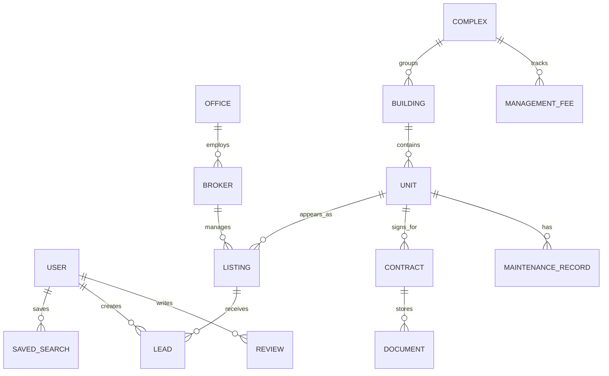
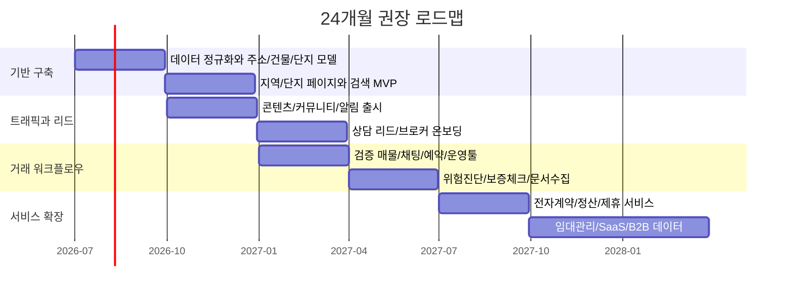

# 한국 부동산 플랫폼 구축 전략 보고서

## 요약

한국에서 부동산 플랫폼을 새로 만든다면, 처음부터 “직거래+전자계약+결제+금융”을 한 번에 다 먹으려는 접근보다, **공공데이터를 잘 엮은 탐색·비교·커뮤니티형 MVP → 검증된 매물/리드/상담 워크플로우가 있는 거래형 마켓플레이스 → 전자계약·보증·입주·관리까지 잇는 풀서비스 플랫폼**으로 계단식 확장을 하는 편이 훨씬 합리적이다. 이유는 세 가지다. 첫째, 한국은 실거래가·임대차 신고·건축물대장·관리비·청약·리츠 통계처럼 핵심 데이터는 공공 시스템에 넓게 퍼져 있어 데이터형 MVP를 빨리 만들 수 있다. 둘째, 거래 실행 단계로 갈수록 공인중개사법, 부동산거래신고, 임대차 신고, 개인정보·위치정보·전자상거래·전자금융 규제가 급격히 무거워진다. 셋째, 시장 선도 사업자들도 순수 광고형 리스팅에서 벗어나 AI 진단, 중개사용 SaaS, 전자계약, 보증·관리·홈서비스 같은 **신뢰와 워크플로우** 쪽으로 무게중심을 옮기고 있다. citeturn0search3turn16search3turn41search0turn48search4turn25search11turn25search0turn20search4turn20search5turn20search6turn20search7turn12search0turn43search14

특히 지금 한국 시장에서 눈에 띄는 변화는 **AI의 검색·시세·위험진단 내재화**, **중개사 대상 구독형 툴·광고상품 고도화**, **전세 리스크 관리와 월세화 진전**, **기관자금과 리츠 시장 확대**, **ESG·에너지·개인정보보호가 제품 요구사항으로 승격된 점**이다. 한국프롭테크포럼은 2026년 핵심 키워드로 AI를 전면에 두고 있고, 직방은 2026년 AI 기반 대화형 검색과 계약 전 리스크 진단을 내세우고 있으며, 주택통계상 월세 거래 비중은 2024년 누계 57.6%, 2025년 1~2월 누계 61.4%로 상승했다. 리츠정보시스템 기준 2026년 5월 전체 리츠는 463개, 자산총액은 123.43조원이며, CBRE는 2025년 한국 상업용 부동산 거래규모를 약 34조원으로 보고 2026년에도 기관투자 수요가 강하다고 본다. citeturn14search1turn12search0turn46search3turn46search4turn21search12turn23search16turn23search11

이 보고서의 핵심 권고는 간단하다. **초기 웨지는 “신뢰도 높은 지역·건물·단지 정보 + 사용자 생성 맥락 데이터 + 상담 전환”**으로 잡고, 그 다음에 **검증 매물과 브로커 워크플로우**, 마지막으로 **전자계약·보증·입주 서비스·관리비/유지관리 데이터·임대관리**를 붙여야 한다. 오늘의집이 콘텐츠/커뮤니티에서 커머스와 O2O로 확장했고, 직방이 원투룸 광고 중심 구조를 아파트 정보·브로커 SaaS·AI 진단으로 바꾸고 있으며, Zillow도 검색 포털에서 에이전트·모기지·렌털·클로징까지 홈저니 전체를 묶는 방향으로 진화한 점이 같은 메시지를 준다. citeturn30search4turn30search1turn31search6turn43search14turn40search6turn40search5

| 권고 단계 | 만들 것 | 왜 이 순서가 맞는가 | 먼저 보게 될 돈 |
|---|---|---|---|
| 탐색·커뮤니티형 MVP | 지도 기반 검색, 건물/단지 페이지, 실거래·관리비·학군/교통 컨텍스트, 저장·알림, 지역 커뮤니티, 상담 리드 | 공공데이터 조합만으로도 차별화 가능하고, 규제 부담이 상대적으로 가볍다 | 광고, 리드 판매, 제휴 쿠폰, 콘텐츠 스폰서십 |
| 거래형 마켓플레이스 | 검증 매물, 브로커 콘솔, 채팅/상담, 방문 예약, 서류 업로드, 위험진단, 표준계약 워크플로우 | 진짜 전환은 “정보”가 아니라 “검증된 실행”에서 발생한다 | 브로커 구독, 성사형 수수료, 상담/리드, 프리미엄 노출 |
| 풀서비스 플랫폼 | 전자계약 연계, 보증·대출 추천, 결제/정산, 입주·이사·청소·인터넷·보험, 임대관리, 자산관리 | 낮은 빈도의 거래를 반복수익으로 바꾸는 단계다 | 거래수수료, SaaS, 핀테크/보험 제휴, 유지관리/관리비 데이터 사업 |

## 시장과 제도 이해

한국 부동산 플랫폼을 설계할 때 먼저 이해해야 하는 것은, 이 시장이 “한 개의 완결된 플랫폼”이 아니라 **공공 원천 시스템과 민간 유통 채널의 조합**으로 굴러간다는 사실이다. 매매 실거래는 국토교통부 실거래가 공개시스템, 임대차 신고는 부동산거래관리시스템, 가격·전월세전환율·거래현황은 한국부동산원 R-ONE, 건물 기본 속성은 건축HUB와 세움터, 주소는 도로명주소 API, 공간 레이어는 브이월드, 아파트 관리비와 유지관리 정보는 K-apt, 청약은 청약Home, 리츠는 국토교통부 리츠정보시스템에 분산되어 있다. 즉, 제품의 승부처는 데이터가 “없음”이 아니라 **서로 다른 키 체계를 가진 데이터를 정합성 있게 묶는 능력**이다. citeturn0search3turn24search1turn16search3turn41search0turn41search3turn16search0turn16search9turn48search4turn26search5turn21search12

거래 유형도 한국만의 특수성이 강하다. 일반적인 매매 외에 전세, 월세, 보증부월세(반전세 포함), 청약/분양, 오피스텔·상가·토지·리츠까지 서로 다른 사용자 여정과 규제가 섞여 있다. 특히 주택 임대차는 계약 후 30일 이내 신고 의무, 신고 항목, 확정일자 연계, 보증금 반환보증 같은 제도적 요소가 강하게 얽혀 있어서, “매물 검색 앱”과 “임대차 실행 플랫폼”은 사실상 다른 제품이라고 봐야 한다. citeturn24search8turn24search10turn42search1turn42search7

플랫폼의 이해관계자도 단순하지 않다. 매수인·매도인·임차인·임대인뿐 아니라 개업공인중개사와 소속공인중개사, 시행사·건설사, 관리사무소, 보증기관(HF/HUG/SGI), 은행·PG, 법무·세무 파트너, 지방자치단체와 국토부·한국부동산원 같은 운영기관까지 모두 제품 설계의 제약조건으로 작동한다. 특히 한국에서는 개업공인중개사가 거래 실행의 핵심 노드이기 때문에, 브로커를 우회해 시장을 통째로 재설계하기보다 **브로커의 생산성을 올리는 방식**이 훨씬 현실적이다. citeturn25search0turn25search12turn25search3turn25search11

| 영역 | 플랫폼이 반드시 알아야 할 핵심 | 설계 포인트 | 주요 1차 원천 |
|---|---|---|---|
| 거래 유형 | 매매, 전세, 월세/보증부월세, 청약/분양, 상업용 임대/매매, 리츠 | 상품 구조를 하나로 뭉개지 말고 거래 유형별 여정을 분리 | 실거래가 공개시스템 citeturn0search3 · 임대차신고 서비스 citeturn24search8 · 청약Home citeturn26search5 · 리츠정보시스템 citeturn21search12 |
| 규제 경계 | 중개행위·표시광고·직거래 오인·전자상거래·개인정보·위치정보·결제 | “우리는 정보제공자인가, 중개보조자인가, 직접 거래중개자인가”를 단계별로 명확히 구분 | 공인중개사법 citeturn25search0turn25search10 · 부동산 직거래플랫폼 가이드 citeturn43search0turn43search4 · 개인정보보호법 citeturn0search2 · 위치정보법 citeturn20search5 · 전자상거래법 citeturn20search4 · 전자금융거래법 citeturn20search6 |
| 공공 데이터 | 가격·거래·건물·주소·지도·관리비·입찰·유지관리·리츠·청약 | 주소·지번·건축물대장 PK·단지 식별자·좌표를 묶는 정규화 레이어 필요 | R-ONE/API citeturn16search3turn16search7 · 건축HUB citeturn41search0 · 도로명주소 API citeturn16search0 · 브이월드 citeturn16search9turn16search13 · K-apt citeturn48search4 |
| 신뢰 레이어 | 허위매물, 전세사기, 불법광고, 보증금 위험, 개인정보 침해 | 매물 검증, 증빙 수집, 위험진단, 신고/삭제 SLA, 감사로그가 핵심 기능 | 허위매물 모니터링 및 중개사 광고 규율 citeturn43search10turn25search9 · 전세지킴보증 citeturn42search1turn42search7 |
| 반복수익 레이어 | 브로커 SaaS, 임대관리, 관리비 벤치마크, 입주 후 서비스 | 거래 이후에 남는 데이터를 구독형 가치로 전환해야 함 | 다방프로·방주인 citeturn34search4 · K-apt 관리정보 citeturn48search4turn48search5 · 전자계약 citeturn25search11 |

실무적으로는 **엔터티 모델을 먼저 고정**하는 게 중요하다. 최소한 `지역 → 단지/건물 → 동 → 호/유닛 → 매물 → 리드/상담 → 계약/입주 → 관리/결제`의 연결 구조가 잡혀야 하고, 여기서 단지 식별자는 한국부동산원 공동주택 단지 식별정보, 건물은 건축물대장 PK, 위치는 도로명주소/지번/좌표를 함께 보관하는 방식이 가장 안전하다. API 스펙이 바뀌거나 운영 시스템이 고도화되더라도 서비스 핵심 ID 체계가 무너지지 않게 해야 하기 때문이다. 한국부동산원 API가 R-ONE 고도화로 교체되는 점만 봐도, 원천 API에 직접 종속된 설계는 장기 유지비가 높다. citeturn16search15turn16search7turn41search0

## 한국 부동산 산업에서 지금 보이는 변화

가장 큰 변화는 **AI가 “있으면 멋진 기능”에서 “없으면 뒤처지는 기본 기능”으로 이동한 것**이다. 한국프롭테크포럼은 2026년 사업의 중심축을 AI에 두고 있고, 협의회도 AI시세·AI인테리어 중심으로 운영한다. 직방은 2026년 카카오톡 기반 대화형 AI 검색과 계약 전 리스크 진단을 공개했고, Zillow도 2026년 AI mode를 내놓으며 홈저니 전반에 AI를 얹고 있다. 한국에서 후발 플랫폼이 가져가야 할 포지션은 “범용 챗봇”이 아니라 **전세 위험, 관리비 이상치, 유사 단지 비교, 허위매물 패턴, 상담 스크리닝**처럼 거래전환에 직접 영향을 주는 특화 AI다. citeturn14search1turn15search3turn12search0turn40search6

둘째 변화는 **브로커 경제학의 재편**이다. 직방은 2024~2025년에 아파트PRO, 아파트BASIC 같은 중개사 대상 상품을 내놓으며 단순 광고형 매출 의존도를 낮추고 있고, 다방 역시 다방프로와 방주인 등 브로커/임대인용 도구를 서비스 포트폴리오에 포함하고 있다. 이건 “리스팅을 많이 모은 플랫폼이 이긴다”는 공식이 약해지고, **정확한 매물 운영·응대 속도·고객관리·지역 전문성**을 도와주는 SaaS가 수익원으로 중요해졌다는 뜻이다. citeturn43search3turn43search7turn43search14turn34search4

셋째 변화는 **전세의 안전성 이슈와 월세화의 진행**이다. 국토부 주택통계에 따르면 월세 거래량 비중은 2024년 누계 57.6%, 2025년 1~2월 누계 61.4%로 상승했다. 동시에 정부는 전세사기 예방을 위해 인터넷은행까지 주담대 심사 시 임차인 확정일자와 보증금을 확인하도록 참여 범위를 확대했고, HF의 전세지킴보증은 보증한도와 선순위채권 기준을 전면에 내세우고 있다. 즉, 지금의 임대차 플랫폼은 “방을 잘 보여주는 UI”보다 **보증금 회수 가능성, 권리·채권 우선순위, 보증 가입 가능성, 신고/확정일자 처리**를 더 잘 설명하고 연결해줘야 경쟁력이 생긴다. citeturn46search3turn46search4turn42search0turn42search1turn42search7

넷째 변화는 **기관투자자·리츠·대체자산의 존재감 확대**다. 리츠정보시스템 기준 2026년 5월 전체 리츠는 463개, 자산총액은 123.43조원이고, 2025년에는 447개·117.86조원까지 커졌다. CBRE는 2025년 한국 상업용 부동산 거래가 약 34조원으로 사상 최대였고, 2026년에도 국내 투자자의 매입 의향이 높다고 본다. Savills와 Reuters 보도를 보면 물류, 데이터센터, 멀티패밀리 같은 섹터가 기관자금의 관심을 끌고 있다. 이는 B2C 주거 플랫폼이라도 장기적으로는 **리츠 정보, 임대운영, 수익형 부동산 데이터, 개발/대체자산 인텔리전스**까지 확장 여지가 있다는 뜻이다. citeturn21search12turn21search3turn23search16turn44search4turn44search19turn47news41

다섯째 변화는 **ESG·에너지·개인정보보호가 제품/브랜드의 후방 지원이 아니라 전면 요구사항이 된 것**이다. 국토부는 공공건축물 제로에너지건축물 인증 의무 대상을 이미 확대 추진해 왔고, 건축물대장 데이터에도 에너지효율, 친환경건축물 등급, 지능형건축물 정보가 포함된다. 동시에 2026년 개인정보위는 쿠팡의 대규모 개인정보 유출과 법적 근거 없는 수집에 대해 6,246억 8,100만원의 과징금을 의결했다. 부동산은 주소, 계약서, 주민번호, 보증금, 위치정보가 얽히는 업종이라서, **보안과 프라이버시 실패는 기능 장애가 아니라 사업 존립 리스크**다. citeturn22search0turn41search4turn39search2

| 변화 | 지금 보이는 신호 | 플랫폼에 주는 의미 |
|---|---|---|
| AI 내재화 | 포럼·사업자 모두 AI를 핵심 키워드로 전환 citeturn14search1turn12search0 | 일반 검색이 아니라 위험진단·유사매물 추천·상담 자동화에 집중해야 함 |
| 브로커 SaaS화 | 직방 아파트PRO/BASIC, 다방프로/방주인 확대 citeturn43search3turn43search7turn34search4 | 공급 측 고객을 광고주가 아니라 “구독 고객”으로 봐야 함 |
| 월세화·전세 안전성 | 월세 비중 상승, 보증·확정일자 확인 강화 citeturn46search3turn46search4turn42search0 | 전세 리스크 분석과 보증 추천이 핵심 UX가 됨 |
| 거래 디지털화 | 전자계약 이용 전년 대비 2배 급증, 공공임대 공실 정보 공개 확대 citeturn43search9turn26search0 | “거래 전후 워크플로우”를 제품에 흡수할 기회가 커짐 |
| 기관화·대체자산 | 리츠 확대, 데이터센터·물류·멀티패밀리 관심 증가 citeturn21search12turn44search4turn47news41 | B2C에서 시작해도 B2B 데이터·관리 서비스로 확장 가능 |
| ESG·프라이버시 | 건물 에너지 데이터 확장, 대형 개인정보 제재 강화 citeturn22search0turn41search4turn39search2 | 보안/프라이버시·에너지 정보는 선택 기능이 아니라 기본값 |

## 단계별 제품 요구사항

가장 현실적인 제품 전략은 **탐색·커뮤니티 MVP에서 시장 맥락과 신뢰를 먼저 쌓고**, 그 다음에 **검증 매물과 브로커 워크플로우를 붙여 거래형 마켓플레이스로 올라간 뒤**, 마지막에 **전자계약·보증·입주·관리·결제**를 묶는 방식이다. 이 순서는 한국의 규제 경계, 공공데이터 접근성, 그리고 선도 사업자들의 확장 경로와 맞아떨어진다. citeturn43search0turn43search9turn30search4turn43search14turn40search6

| 단계 | 제품 목표 | 우선순위 기능 | 필수 데이터/API | 주요 사용자 역할 | 핵심 KPI | 보안·컴플라이언스 |
|---|---|---|---|---|---|---|
| 탐색·커뮤니티 MVP | “이 동네/이 건물/이 단지에 대한 가장 믿을 만한 맥락”을 만든다 | 지도 검색, 단지/건물 페이지, 실거래/전월세 지표, 관리비/유지관리 요약, 저장/알림, 지역 Q&A, 콘텐츠/가이드, 상담 리드 폼, 허위정보 신고 | 실거래가 공개시스템, R-ONE 가격/전월세전환율/API, 건축HUB, 도로명주소 API, 브이월드, K-apt, 공동주택 단지 식별정보 citeturn0search3turn16search3turn41search0turn16search0turn16search9turn48search4turn16search15 | 방문자, 회원, 지역 기여자, 운영자, 제휴 브로커 | 유입 대비 회원전환율, 저장검색 수, 알림 CTR, 상담 전환율, 지역 페이지 SEO 유입, 허위정보 신고 처리 SLA | 개인정보 최소수집, 동의관리, 위치정보 수집 시 분리동의, 커뮤니티 명예훼손/광고 모더레이션, 정보제공자 포지셔닝 유지 citeturn0search2turn20search5turn20search7 |
| 거래형 마켓플레이스 | “검증된 상담·방문·계약 준비”까지 제품 안에서 이어준다 | 매물 검증 온보딩, 브로커 콘솔, 리드 라우팅, 채팅/통화 마스킹, 방문예약, 상담 로그, 표준 체크리스트, 서류 업로드, AI 위험진단, 보증 적합성 체크, 전자계약 연계 준비 | 위 데이터 + 브로커/중개사무소 정보, 임대차 신고 요건, 전자계약시스템, 보증기관 상품 조건, 통계 API 캐시, 내부 검증 로그 citeturn25search11turn24search8turn42search1turn42search3 | 임차인/매수인, 임대인/매도인, 개업공인중개사, CS/검수 운영자 | 검증 매물 비율, 리드→방문율, 방문→계약준비율, 브로커 구독 전환율, 리드 응답속도, 취소율/노쇼율 | 공인중개사법상 표시광고 준수, 직거래 오인 방지, 전자상거래법상 고지/환불정책, 문서 암호화·감사로그, 권한기반 접근통제 citeturn25search0turn25search12turn43search0turn20search4turn0search2 |
| 풀서비스 플랫폼 | “집 찾기 이후의 반복 수익”을 만든다 | 전자계약/신고 연계, 보증·대출 추천, 결제/정산, 이사/청소/인터넷/보험 번들, 입주 체크리스트, 임대관리 포털, 관리비 분석, 유지관리 티켓, 오너/PM SaaS, 포트폴리오 대시보드 | 위 데이터 + 결제/정산 시스템, 관리비/유지관리 데이터, 파트너 API, 계약 문서 보관소, 리츠/투자 정보, 이벤트 로그/추천 모델 | 오너·임대인, 임차인, PM, 브로커, 제휴사, 투자자/B2B 고객 | GMV, take rate, attach rate, MRR/ARR, 재방문율, 계약후 90일 잔존, CS 비용, 사고율/클레임률 | PIPA 고도통제, 전자금융/PG 연계, 위치·행동데이터 목적 제한, 보존기간 정책, 사고 대응 플랜, 대규모 서비스 수준의 보안체계 검토 citeturn20search6turn0search2turn39search2 |

초기 데이터 모델은 “매물”을 중심에 두기보다 “건물/단지와 유닛”을 중심에 두는 편이 좋다. 한국에서는 동일 유닛이라도 시점별로 여러 매물, 여러 브로커, 여러 가격 제안이 붙을 수 있기 때문이다. 나중에 AI 추천이나 리스크 진단을 하려면 **유닛의 고정 속성**과 **매물의 시점 속성**을 분리해 두는 편이 훨씬 유리하다. 이 구조는 건축물대장, 단지 식별정보, 관리비 시스템, 거래 이력 시스템을 자연스럽게 연결해 준다. citeturn41search0turn16search15turn48search4

이 ER 방향은 공공 원천별 키를 서비스 내부의 표준 엔터티로 통합하기 위한 권장 구조다. 특히 `COMPLEX/BUILDING/UNIT/LISTING` 분리가 되어야 K-apt 관리비, 건축물대장, 실거래가, 브로커 매물, 계약문서를 깨지지 않게 연결할 수 있다. citeturn48search4turn41search0turn0search3

## 기술 스택과 아키텍처 선택지

기술 선택의 핵심은 “지금 당장 제일 멋진 스택”이 아니라 **데이터 정합성·검색 품질·운영 속도·개인정보 통제**다. 한국 부동산 플랫폼은 이미지 피드나 일반 커머스보다 주소/좌표/단지 식별/문서보관/규제 로그가 중요하므로, 초기에는 **모듈형 모놀리스 + 강한 데이터 모델**이, 중후기에는 **검색/이벤트/문서/정산을 분리한 도메인 확장**이 보통 더 낫다. 지도는 소비자 UX에선 카카오/네이버가 강하지만, 공공 레이어와 공간분석은 브이월드가 중요하고, 검색은 초기엔 PostgreSQL FTS/pgvector로 시작해도 되지만 거래형 단계에선 OpenSearch 계열이 유리해진다. citeturn19search1turn19search10turn19search25turn19search0turn16search9turn17search5turn17search7

| 스택 프로필 | 추천 구성 | 장점 | 약점 | 비용·복잡도 추정 |
|---|---|---|---|---|
| 린 MVP | Next.js/React, Supabase Auth+Postgres(+pgvector/PostGIS), Vercel, 서버리스 함수, 객체스토리지, PostgreSQL FTS, 카카오/네이버 지도 SDK, 브이월드 레이어 | 출시 속도 빠름, 인프라 인력 최소화, 운영 자동화에 유리 | 벤더 종속성, 복잡한 배치/권한/검색 고도화 시 한계, 대용량 로그 분석 불리 | **비용 낮음 / 복잡도 낮음**. Vercel Pro는 월 $20부터, Supabase는 Pro에서 MAU·스토리지·egress 기준 과금, 카카오/네이버 지도는 무료 쿼터 이후 확장 구조다. 일반적인 초기 트래픽이면 월 수십만~백만원대 초반으로 시작 가능하다. citeturn17search0turn17search1turn19search1turn19search10turn19search0 |
| 성장형 마켓플레이스 | Next.js, FastAPI 또는 NestJS, PostgreSQL(RDS/Cloud SQL), Redis, OpenSearch/Elastic, S3, ECS/Fargate 또는 GKE, GitHub Actions, IaC(Terraform) | 검색·권한·배치·검증 파이프라인·운영자 도구를 안정적으로 분리 가능 | DevOps 난이도 상승, 검색/로그 비용 증가, 운영자 숙련도 필요 | **비용 중간 / 복잡도 중간**. AWS는 온디맨드 구조이고, Elastic hosted는 최소 약 $99/월 스타팅 티어가 있으며 리소스 기반 과금이다. Moderate traffic와 검수/검색/작업큐가 붙으면 월 수백만 원대로 올라갈 가능성이 높다. citeturn18search5turn18search17turn17search5turn17search7 |
| 풀서비스 플랫폼 | 도메인 중심 서비스 분리, Kubernetes/EKS 또는 ECS, PostgreSQL + OpenSearch + ClickHouse/BigQuery, Kafka/Event Bus, 문서보관소, feature store, ML inference 서비스, 별도 admin/backend-for-frontend | 계약·정산·보증·입주·관리·B2B 데이터 상품까지 확장 가능 | 팀과 운영 역량이 부족하면 과설계 위험, 인건비와 SRE 부담 큼 | **비용 높음 / 복잡도 높음**. 이 단계부터는 인프라 비용보다 인력과 보안 통제가 더 큰 비용 항목이 되며, 수천만 원/월 인프라보다 “보안·데이터·CS·컴플라이언스 조직” 비용이 더 빨리 증가한다. 쿠팡 사례처럼 개인정보 사고 비용은 인프라 절감 효과를 압도할 수 있다. citeturn39search2turn38search6 |

스택 선택에서 특히 중요한 트레이드오프는 네 가지다. 첫째, **지도 UX와 데이터 자주권**이다. 카카오/네이버는 소비자 경험이 좋지만 권한·쿼터·상업 정책 관리가 필요하고, 브이월드는 공공 공간정보 레이어에 강하다. 둘째, **PostgreSQL 단일화와 별도 검색엔진 도입 시점**이다. MVP는 Postgres로 버티되, 매물·단지·가격·질문글·문서를 한꺼번에 잘 찾고 랭킹까지 만지기 시작하면 OpenSearch가 보통 필요해진다. 셋째, **서버리스/관리형 편의와 감사가능성**이다. 계약서·신분증·주소·위치정보가 얽히므로 로그/auditability가 빈약한 편의형 스택은 오래 못 간다. 넷째, **호스티드 LLM과 자체 모델 운영**이다. 초기는 API 호출이 빠르지만, 상담요약·문서분석·리스크 진단이 핵심 가치가 되면 비용·지연시간·데이터 통제를 재검토해야 한다. citeturn19search1turn19search25turn16search9turn17search5turn17search7turn39search2

권장 아키텍처 원칙은 세 가지다. **첫째, 개인정보 도메인과 공개 데이터 도메인을 분리**하고, **둘째, 주소/건물/단지 정규화 레이어를 코어 서비스로 독립**시키며, **셋째, 모든 매물·상담·문서·삭제 조치에 감사로그를 남기는 것**이다. 한국의 규제 환경에서는 기능 속도도 중요하지만, 나중에 “왜 이 매물이 노출됐는지”, “누가 어떤 정보를 봤는지”, “신고 후 얼마 만에 내렸는지”를 설명할 수 있어야 한다. citeturn25search9turn43search0turn39search2

## 수익화와 초기 시장 진입

초기 수익화는 “거래수수료가 제일 커 보이니 그걸 먼저”가 아니라, **주기가 짧고 마찰이 낮은 돈부터** 들어와야 한다. 한국 부동산은 거래 빈도가 낮고 규제가 두껍기 때문에, 초기는 광고/리드/제휴/구독, 중기는 브로커 SaaS/프리미엄 노출/성사형 수수료, 후기는 계약 후 반복 서비스와 임대관리·데이터 사업으로 가는 편이 구조적으로 안정적이다. 오늘의집이 콘텐츠·커뮤니티를 바탕으로 커머스와 O2O를 붙였고, 직방은 브로커용 구독 상품과 AI 신뢰 기능을 키우고 있으며, Zillow는 에이전트·모기지·렌털·클로징을 홈저니 전체로 묶고 있다. citeturn30search4turn30search1turn31search6turn43search14turn40search5turn40search6

| 단계 | 가장 현실적인 수익모델 | 무엇을 팔고 있는가 |
|---|---|---|
| 초기 | 리드 판매, 스폰서 콘텐츠, 지역 페이지 광고, 제휴 쿠폰, 데이터 기반 로컬 광고 | “트래픽”이 아니라 “의도가 있는 사용자” |
| 성장 | 브로커 구독, 검증 매물 프리미엄, 업셀 상품, 성사형 수수료 일부, 상담센터 대행 | “거래 가능성이 높은 워크플로우” |
| 확장 | 거래수수료, 보증/보험/이사/인터넷/청소 제휴수수료, 임대관리 SaaS, B2B 데이터 구독 | “거래 후 반복되는 운영과 금융 맥락” |

초기 GTM은 한국 시장에선 **커뮤니티와 콘텐츠가 CAC를 낮추는 가장 현실적인 방법**이다. 검색 광고만 돌리면 직방·다방·네이버 부동산류와 바로 비싼 경쟁에 들어간다. 반면 “역세권별 원룸 관리비 맵”, “전세보증 안전체크”, “단지별 실거래/관리비/입주연차 카드”, “청약/공공임대/입주 체크리스트”, “허위매물 의심 패턴 사전 점검” 같은 도구형 콘텐츠는 SEO·바이럴·리드 전환을 동시에 만든다. 정부도 공공임대 공실 정보 공개와 모집 정기화를 늘리고 있고, 전자계약도 빠르게 늘고 있어서, 사용자 입장에선 “복잡한 제도를 풀어주는 제품”의 가치가 커지고 있다. citeturn26search0turn26search1turn43search9

초기 공급 확보는 “서울 전역 1만 중개사 확보”보다 **동네별 10~30명의 강한 공급자**가 낫다. 예를 들어 성수·동탄·마곡·분당 같은 특정 로컬 마이크로마켓에 집중해, 브로커에게는 무료 데이터 대시보드·콜마스킹·리드 배정·응답 속도 리포트, 사용자에게는 검증 배지·리스크 카드·리뷰를 제공하는 방식이다. 오늘의집 O2O가 우수 업체 발굴과 멤버십 전환을 강조하는 구조, 다방이 다방프로/방주인으로 공급자 도구를 확장한 구조가 참고할 만하다. citeturn30search2turn34search4

쿠폰/할인은 거래 당사자의 본질 문제를 해결할 때만 효과가 있다. 그냥 “첫 달 이용권”보다 **보증 가능성 무료 점검**, **계약서 안전진단 할인**, **이사/청소 번들**, **입주 인터넷/가전/보험 쿠폰**이 훨씬 전환력이 높다. 부동산은 고객이 싼 곳을 찾는 게 아니라 **실수했을 때 손실이 큰 업종**이기 때문이다. 이 점에서 쿠팡의 교훈은 “할인 그 자체”보다 **멤버십이 반복 이용을 정당화할 명확한 편익 묶음**을 제공했다는 데 있다. 다만 개인정보 사고가 브랜드를 훼손할 수 있다는 점은 강한 경고다. citeturn38search1turn39search2

## 경쟁사와 성장 사례 비교

아래 비교표는 한국 부동산/주거 플랫폼을 만들 때 가장 자주 참고하게 되는 사례들을 “무슨 순서로 확장했는가” 중심으로 정리한 것이다. 핵심은 거의 모두가 **하이프리퀀시 영역에서 저마찰 웨지 확보 → 신뢰/워크플로우 → 고부가 서비스** 순서로 움직였다는 점이다. citeturn30search4turn43search14turn40search6turn33search4turn38search0

| 회사 | 출발점 → 확장 경로 | 현재 핵심 가치 | 수익모델 | 배울 점 |
|---|---|---|---|---|
| 오늘의집 | UGC 집들이/노하우 → 스토어 커머스 → 인테리어/이사/청소 O2O → 3D 플래너·전문가 네트워크. 2025년 매출 3,215억원, 11년 연속 두 자릿수 성장. citeturn30search4turn30search1turn31search6 | 콘텐츠로 취향을 만들고, 커머스로 구매를 받고, O2O로 고액 서비스를 붙인다 | 커머스 수수료, 광고, O2O/시공, 전문가 멤버십 | **콘텐츠-커뮤니티-커머스-서비스** 플라이휠은 부동산에도 유효하다. 먼저 “살고 싶은 방식”을 잡아야 거래 전환이 쉬워진다 |
| 직방 | 원투룸 매물 광고 → 아파트 정보/호갱노노 → 스마트홈 → 브로커 SaaS(아파트PRO/BASIC) → AI 검색·리스크 진단. 2024년 매출 1,014억원, 영업손실 개선. citeturn12search2turn43search3turn43search7turn12search0 | 단순 광고판이 아니라 **정보+브로커 도구+신뢰** 플랫폼 | 매물 광고, 브로커 구독, 정보성 광고, 스마트홈 | 리스팅 광고만으로는 취약하다. **브로커 생산성 도구와 신뢰 기능**을 붙여야 방어력이 생긴다 |
| 다방 | 원룸/투룸 임대 플랫폼 → VR 매물보기 → 시세리포트 → 다방프로 → 방주인/임대관리. 회사 소개상 “통합 주거 플랫폼”을 지향. citeturn34search1turn34search4 | 임차인-임대인-중개사 연결을 빠르고 편리하게 한다 | 광고, 중개사용 툴, 임대관리 | 좁은 카테고리(원룸)에서 시작해도 공급자 도구와 관리 영역으로 넓힐 수 있다 |
| Zillow | 검색 포털 → Premier Agent 마켓플레이스 → 소프트웨어(Follow Up Boss, ShowingTime, dotloop) → 모기지·렌털·클로징. 2026년 Q1 매출 7.08억달러, 월간 UU 2.2억명, AI mode 출시. citeturn40search2turn40search5turn40search6 | 홈저니 전체를 한 생태계에 넣는다 | 에이전트 광고/리드, 소프트웨어, 모기지, 렌털, 클로징 | 검색 트래픽만이 아니라 **에이전트 툴+금융+업무 소프트웨어**로 다층 수익을 만든다 |
| Redfin | 검색 포털 → 자체 브로커리지 → 모기지·타이틀·렌털 → 2025년 Rocket에 인수 완료. 2025년 1분기 사업은 실거래 서비스·렌털·모기지·타이틀·monetization으로 구분. citeturn33search2turn33search3turn33search4 | 직접 서비스 품질 통제를 노리는 디지털 브로커리지 | 브로커리지 수수료, 모기지, 타이틀, 렌털 | 서비스 통제력은 강하지만 운영원가와 시장 변동성도 크게 탄다. **직접 중개 내재화는 늦게 판단**하는 편이 낫다 |
| Coupang | 저가 커머스 → 로켓배송/로켓와우 → 반복 이용 생태계 확장. 2026년 Q1 매출 85억달러. 다만 2026년 개인정보위 과징금 6,246억 8,100만원 사례 발생. citeturn38search0turn38search6turn38search1turn39search2 | 빠른 반복수요와 멤버십 결속 | 마켓플레이스, 멤버십, 광고, 핀테크 | 성장 비유로는 훌륭하지만, **신뢰와 보안이 무너지면 플라이휠도 흔들린다**는 점을 같이 배워야 한다 |

이 표를 한국 부동산 플랫폼에 적용하면, 가장 좋은 성장 순서는 대체로 **콘텐츠/데이터 웨지 → 공급 측 툴 → 거래 워크플로우 → 금융/관리 반복수익**이다. 반대로 가장 위험한 순서는 **브랜드와 신뢰가 약한 상태에서 결제·계약·개인정보를 먼저 크게 먹는 것**이다. citeturn31search6turn43search14turn40search5turn39search2

## 정보원과 실행 로드맵

한국 부동산 플랫폼을 운영할 때 꾸준히 봐야 하는 정보원은 **공식 통계/법령/운영 시스템 → 산업 단체와 사업자 뉴스룸 → 보조 커뮤니티** 순으로 우선순위를 두는 게 좋다. 네이버 카페나 유튜브는 현장 온도를 읽는 데 유용하지만, 정책·통계·제도 판단은 반드시 공식 원천으로 역검증해야 한다. 특히 한국은 제도 변경과 운영 가이드가 자주 나오므로, 국토부·한국부동산원·개인정보위·리츠/청약/관리비 시스템을 상시 모니터링하는 루틴이 제품 경쟁력의 일부가 된다. citeturn27search8turn45search15turn39search8turn21search12turn48search4

| 분류 | 우선순위 | 무엇을 보기 좋은가 | 추천 원천 |
|---|---|---|---|
| 공식 정책 | 매우 높음 | 법·제도·보도자료·가이드·메일링 | 국토교통부 포털/보도자료/메일링/유튜브 citeturn26search9turn27search1turn27search18 |
| 공식 통계 | 매우 높음 | 가격지수, 전월세전환율, 거래현황, 보도자료 | 한국부동산원 REB/R-ONE/API citeturn45search15turn16search3 |
| 공식 거래/실행 시스템 | 매우 높음 | 실거래, 임대차 신고, 전자계약, 청약, 공공임대 | 실거래가 공개시스템 citeturn0search3 · RTMS 임대차신고 citeturn24search8 · IRTS 전자계약 citeturn25search11 · 청약Home citeturn26search5 |
| 공식 자산/관리 데이터 | 높음 | 건축물대장, 주소, 지도, 관리비, 유지관리 | 건축HUB citeturn41search0 · 도로명주소 API citeturn16search0 · 브이월드 citeturn16search9 · K-apt citeturn48search4 |
| 공식 투자/기관 데이터 | 높음 | 리츠, 상장리츠, 투자자산 | 리츠정보시스템 citeturn21search12turn21search15 |
| 공식 컴플라이언스 | 높음 | 개인정보, AI/데이터 규율, 제재 동향 | 개인정보보호위원회 citeturn39search8 |
| 산업단체 | 높음 | 프롭테크 맵, 리포트, 뉴스레터, 밋업 | 한국프롭테크포럼 citeturn27search0turn27search12turn27search22 |
| 사업자 뉴스룸 | 중간 | 사업자 전략 변화, 기능 출시, 시장 실험 | 직방 뉴스룸 citeturn12search0 · 오늘의집 뉴스룸 citeturn31search2 · 스테이션3 소개/서비스 citeturn34search1turn34search4 |
| 보조 커뮤니티 | 중간~낮음 | 현장 반응, 지역별 체감, 사용자 불만 패턴 | 부동산 스터디(보조 확인용) citeturn28search20 · 월급쟁이부자들/네이버카페 연동 정보 citeturn28search4turn28search13 |
| 팟캐스트/영상 | 낮음~중간 | 해설과 내러티브 보강 | JLL 팟캐스트 citeturn28search26 · 국토교통부 유튜브 citeturn27search18 |

이 로드맵은 **창업자 1 + 풀스택 1 + 디자인/리서치 0.5 + 운영/콘텐츠 0.5** 수준에서도 시작 가능하도록 짰다. 다만 거래형 단계로 넘어가면 개발보다 **검수/CS/컴플라이언스·브로커 성공관리 인력**이 더 중요해진다. 순서는 “데이터 웨지 → 반복 방문 → 공급 측 툴 → 검증 워크플로우 → 계약 연계 → 입주 후 반복수익”이다. citeturn30search1turn43search14turn43search9

| 분기 | 목표 | 최소 팀/채용 | 측정 가능한 산출물 |
|---|---|---|---|
| 2026 Q3 | 데이터 코어와 MVP 골격 | 창업자/PM, 풀스택 1, 디자이너 0.5, 데이터 엔지니어 또는 리서치 0.5(겸임 가능) | 주소·건물·단지 정규화 테이블, 3개 집중 지역, 1만~3만 개 단지/건물 카드, 검색/지도/저장/알림 동작 |
| 2026 Q4 | 탐색형 MVP 공개와 첫 유입 | 위 팀 + 콘텐츠/운영 1 계약직 | 월간 방문자 3만~10만, SEO 랜딩 100개+, 저장검색 3천+, 상담 리드 전환율 1~3% |
| 2027 Q1 | 브로커 콘솔과 리드 엔진 | 백엔드/운영툴 엔지니어 1 추가, 브로커 성공관리 1 | 파트너 브로커 20~50곳, 응답속도 리포트, 채팅/예약/콜마스킹, 리드→방문 전환 측정 |
| 2027 Q2 | 검증 매물과 위험진단 | 검수/CS 1, 데이터 분석 0.5 | 검증 매물 비율 60%+, 허위 신고 처리 SLA 24~48시간, 위험진단 카드, 보증 체크 프로토타입 |
| 2027 Q3 | 거래형 마켓플레이스화 | BizDev/제휴 1, 운영/컴플라이언스 1 | 전자계약 연계 PoC, 표준 문서 업로드, 제휴 3~5개(이사/청소/인터넷/보험), 브로커 구독 시작 |
| 2027 Q4 | 수익 다변화 | Growth 1, CS 1 | 월 반복매출(MRR) 발생, 유료 브로커 50~100, 제휴 attach rate 5~10%, 지역 확장 5~8개 |
| 2028 Q1 | 풀서비스 일부 진입 | PM/운영 강화, 데이터/ML 1 | 입주 체크리스트, 정산/결제 일부, 오너 대시보드, 관리비 비교 및 유지관리 기능 |
| 2028 Q2 | 수익형 운영 플랫폼화 | SaaS 세일즈 1, 데이터/리서치 1 | 임대관리 고객 확보, B2B 데이터 구독 시범, 12개월 리텐션과 LTV/CAC 측정 체계 완성 |

| 리스크 | 왜 큰가 | 완화 방안 |
|---|---|---|
| 무자격 중개 오인 | 직거래 플랫폼도 가이드 배포 대상이 될 정도로 감독이 강해짐 citeturn43search0turn43search4 | 정보제공/광고/중개보조 경계를 명시, 브로커 개입 포인트를 제품에 명확히 넣기 |
| 허위매물·허위광고 | 이용자 신뢰가 순식간에 무너짐 citeturn43search10turn25search9 | 검증 배지, 증빙 제출, 신고/삭제 SLA, 노출 패널티, 상습 계정 차단 |
| 개인정보 유출 | 부동산 업종은 주소·문서·보증금이 얽혀 피해가 큼 citeturn39search2 | 최소수집, 암호화, 권한분리, 문서 DLP, 사고대응 시나리오와 감사로그 |
| 리드 품질 악화 | 브로커·사용자 양쪽이 떠남 | 지역 집중 전략, 응답속도/성사율 기반 리드 분배, 품질 낮은 공급자 퇴출 |
| 정책/시장 급변 | 금리·공급·규제 변화가 제품 지표에 즉시 반영됨 citeturn23search16turn45search10 | 지역·상품군 분산, 매매/임대/공공임대/입주 후 서비스 포트폴리오 분산 |
| 과도한 기술 선투자 | 트래픽보다 시스템 복잡도가 먼저 폭증 | MVP는 모듈형 모놀리스, 거래형 단계에서만 검색/정산/문서 서비스를 분리 |

최근 동향을 빠르게 따라가려면 아래 기사 묶음을 함께 보는 것이 좋다.

navlist최근 부동산 플랫폼과 시장 변화 기사turn47news39,turn47news41,turn38news22,turn33news28